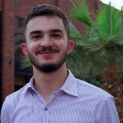

_<code style="color : purple">ai researcher specializing in computer vision, image processing, and optical character recognition</code>_

> email: [ameer.ha.majeed@gmail.com](ameer.ha.majeed@gmail.com)

> github: [ameermajeed](https://github.com/ameermajeed)

## education
__bachelor of science in computer science__
- university of kurdistan hewler, iraq (2020 - 2024)

## work experience
__data scientist__ - ovanya, iraq (july 2024 - now)

__research assistant__ - nishtman strategy institute, iraq (may 2023 - april 2024)

__research intern__ - university of kurdistan hewler, iraq (august 2023 - september 2023)

__data science trainee__ - ovanya, iraq (febraury 2022 - april 2022)

## projects
__Optical Character Recognition for Handwritten Syriac Text:__ 
> This project aims to develop an Optical Character Recognition (OCR) model so as to recognize handwritten text of the Syriac language and output them in a digitized format using fine-tuning of the Tesseract-OCR engine’s LSTM pre-trained model on handwritten data. And it also seeks to bring forth a dataset that consists of handwritten Syriac sentences, of which were collected from volunteers that are capable of reading and writing in the language.

## publications
> N/A

## skills
### programming languages:
* python

### libraries and tools:
* tesseract-ocr
* opencv
* pillow
* numpy
* pandas
* matplotlib

## awards & honors
__first place in the 11th undergraduate research and innovation competition (uric)__ - abu dhabi university, united arab emirates
* category: artificial intelligence and machine learning

__ukh undergraduate scholarship__ - university of kurdistan hewler, iraq

## extracurricular activities
__member__  - general union of kurdistan students, iraq (july 2023 - Now)

__representative of the school of science and engineering__ - ukh student union (december 2021 - august
2022)

## languages
__kurdish__ - native

__arabic__ - fluent

__english__ - fluent

__chaldean neo-aramaic__ - intermediate
